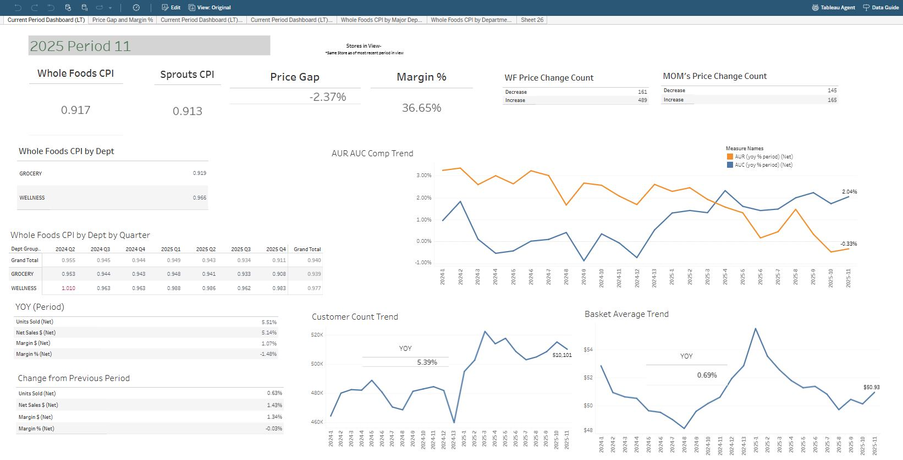

# Tableau Dashboard Maintenance & Enhancements

**Project Overview**  
This project showcases a Tableau dashboard I am responsible for updating and maintaining on a recurring basis. Drawing on skills learned from a Tableau certification course (Udemy), I implemented formatting and usability enhancements to improve stakeholder interpretation and overall readability.

---

## Key Highlights
- Applied formatting adjustments to improve visual hierarchy and readability  
- Enhanced filters, labels, and layout to optimize dashboard usability  
- Ensured the dashboard reflects current business metrics and reporting needs  
- Applied best practices learned from Tableau certification

---

## Tools & Technologies
- **Tableau Desktop / Tableau Server** – Dashboard creation, formatting, and updates  
- **Microsoft Excel** – Source data preparation and cleaning

---

## Methodology
1. Reviewed existing dashboard to identify areas for visual and usability improvements  
2. Applied formatting changes such as consistent colors, fonts, and label placement  
3. Improved filter logic and dashboard layout based on stakeholder feedback  
4. Validated that dashboard metrics are accurate and aligned with reporting requirements

---

## Visual Sample
Below is an example of the updated Tableau dashboard:

---

## Skills Demonstrated
- Dashboard maintenance and updates  
- Data visualization best practices  
- Applying certification skills to real-world projects  
- Stakeholder-focused design improvements
